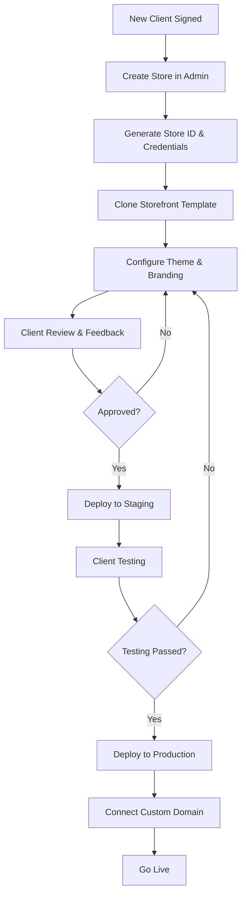

# Business Model & Multi-Storefront Strategy

## Overview

Your business model is to sell a **custom-branded e-commerce solution** where:
- ✅ **One Backend** serves all clients (multi-tenant)
- ✅ **One Admin Panel** serves all clients (tenant-aware)
- ✅ **Multiple Storefronts** - Each client gets their own custom-designed storefront
- ✅ **Data Isolation** - Each store's data is completely isolated

## Why This Approach is Excellent

### 1. **Cost Efficiency** 
- **Shared Infrastructure**: One backend deployment serves all clients
- **Lower Maintenance**: Update backend once, all stores benefit
- **Reduced Server Costs**: Shared database, cache, and resources

### 2. **Customization Freedom**
- **Unique Branding**: Each client gets their own storefront design
- **No Design Limits**: Not constrained by a single template
- **Client Satisfaction**: They feel they own a custom solution

### 3. **Scalability**
- **Easy Onboarding**: Add new stores without touching core infrastructure
- **Independent Deployment**: Each storefront can be deployed separately
- **No Performance Impact**: New stores don't slow down existing ones

### 4. **Competitive Advantage**
- **Not SaaS-looking**: Clients get white-labeled solutions
- **Premium Positioning**: Can charge more than cookie-cutter SaaS
- **Market Flexibility**: Can serve different industries with different storefronts

## Current Architecture Alignment

Your existing architecture **already supports this perfectly**:

```
┌─────────────────────────────────────────────────────┐
│              CLIENT A STOREFRONT                    │
│         (Custom Design - Fashion Store)             │
└──────────────────┬──────────────────────────────────┘
                   │
┌──────────────────▼──────────────────────────────────┐
│              CLIENT B STOREFRONT                    │
│         (Custom Design - Electronics)               │
└──────────────────┬──────────────────────────────────┘
                   │
┌──────────────────▼──────────────────────────────────┐
│              CLIENT C STOREFRONT                    │
│         (Custom Design - Food Delivery)             │
└──────────────────┬──────────────────────────────────┘
                   │
        ┌──────────▼──────────┐
        │   API GATEWAY       │
        │   (store_id based)  │
        └──────────┬──────────┘
                   │
    ┌──────────────┼──────────────┐
    │              │              │
┌───▼────────┐ ┌──▼─────────┐ ┌─▼────────────┐
│  Backend   │ │ Admin Panel│ │   Database   │
│ (Laravel)  │ │  (React)   │ │ (Multi-tenant)│
│  Shared    │ │   Shared   │ │    Shared     │
└────────────┘ └────────────┘ └──────────────┘
```

## Strategic Improvements

### 1. **Storefront as a Starter Kit/Template**

**Create a "Base Storefront" Repository**:

```
storefront-template/
├── core/                      # Core functionality (DO NOT MODIFY)
│   ├── api/                   # API client
│   ├── hooks/                 # Shared hooks
│   ├── utils/                 # Utilities
│   └── types/                 # TypeScript types
├── components/
│   ├── shared/                # Reusable components
│   └── customizable/          # Client-specific components
├── theme/
│   ├── colors.ts              # Theme colors
│   ├── fonts.ts               # Typography
│   └── config.ts              # Theme configuration
├── pages/                     # Next.js pages (customizable)
├── public/                    # Static assets (client branding)
└── .env.template              # Environment template
```

**New Client Onboarding Flow**:
```bash
# 1. Clone template for new client
git clone storefront-template client-fashion-store
cd client-fashion-store

# 2. Configure for new store
cp .env.template .env.local
# Set NEXT_PUBLIC_STORE_ID=new_store_id

# 3. Customize theme
# Edit theme/colors.ts, theme/fonts.ts

# 4. Customize components and pages as needed

# 5. Deploy to separate domain
vercel deploy --prod
```

### 2. **Theme System (High Priority)**

**Centralized Theme Configuration**:

```typescript
// theme/config.ts
export const themeConfig = {
  store_id: process.env.NEXT_PUBLIC_STORE_ID,
  
  branding: {
    name: 'Fashion Store',
    logo: '/logo.png',
    favicon: '/favicon.ico',
  },
  
  colors: {
    primary: '#FF6B6B',
    secondary: '#4ECDC4',
    accent: '#FFE66D',
    background: '#FFFFFF',
    text: '#2C3E50',
  },
  
  typography: {
    fontFamily: '"Inter", sans-serif',
    headingFamily: '"Playfair Display", serif',
  },
  
  layout: {
    headerStyle: 'centered', // 'centered' | 'left-aligned' | 'minimal'
    footerColumns: 4,
    maxWidth: '1440px',
  },
  
  features: {
    wishlist: true,
    reviews: true,
    quickView: true,
    sizeGuide: true,
  },
};
```

**Dynamic Theme Application**:

```typescript
// components/ThemeProvider.tsx
'use client';

import { createContext, useContext } from 'react';
import { themeConfig } from '@/theme/config';

const ThemeContext = createContext(themeConfig);

export function ThemeProvider({ children }: { children: React.ReactNode }) {
  return (
    <ThemeContext.Provider value={themeConfig}>
      <div
        style={{
          '--color-primary': themeConfig.colors.primary,
          '--color-secondary': themeConfig.colors.secondary,
          '--font-base': themeConfig.typography.fontFamily,
        } as React.CSSProperties}
      >
        {children}
      </div>
    </ThemeContext.Provider>
  );
}

export const useTheme = () => useContext(ThemeContext);
```

### 3. **Shared Component Library (Critical)**

**Create NPM Package for Core Components**:

```
@your-company/ecommerce-components/
├── src/
│   ├── ProductCard/
│   ├── CartDrawer/
│   ├── CheckoutForm/
│   ├── OrderTracking/
│   └── index.ts
├── package.json
└── README.md
```

**Benefits**:
- Update once, all storefronts get improvements
- Maintain consistency
- Fix bugs in one place
- Share between projects

**Usage in Client Storefronts**:

```typescript
// Install in each storefront
npm install @your-company/ecommerce-components

// Use in pages
import { ProductCard, CartDrawer } from '@your-company/ecommerce-components';

// Apply client-specific styling via props or CSS
<ProductCard 
  product={product} 
  theme={themeConfig.colors}
/>
```

### 4. **API Client Abstraction**

**Shared API Client Package**:

```typescript
// @your-company/ecommerce-api-client
export class EcommerceAPI {
  constructor(
    private baseUrl: string,
    private storeId: string
  ) {}

  async getProducts(params: ProductQuery): Promise<Product[]> {
    const response = await fetch(`${this.baseUrl}/storefront/products`, {
      headers: {
        'X-Store-ID': this.storeId,
      },
      params,
    });
    return response.json();
  }

  async createOrder(data: CreateOrderDTO): Promise<Order> {
    // ... implementation
  }
}

// Usage in each storefront
const api = new EcommerceAPI(
  process.env.NEXT_PUBLIC_API_URL!,
  process.env.NEXT_PUBLIC_STORE_ID!
);
```

### 5. **Backend Enhancements**

#### A. Store-Specific Configuration API

```php
// New endpoint: GET /api/v1/storefront/config
public function getStoreConfig(Request $request): JsonResponse
{
    $storeId = $request->header('X-Store-ID');
    
    $config = [
        'store' => Store::find($storeId),
        'settings' => StoreSettings::where('store_id', $storeId)->get(),
        'theme' => [
            'colors' => $this->getThemeColors($storeId),
            'fonts' => $this->getThemeFonts($storeId),
            'logo_url' => $this->getLogoUrl($storeId),
        ],
        'features' => [
            'wishlist_enabled' => true,
            'reviews_enabled' => true,
            'guest_checkout' => true,
        ],
        'payment_methods' => $this->getEnabledPaymentMethods($storeId),
        'shipping_methods' => $this->getShippingMethods($storeId),
    ];
    
    return response()->json($config);
}
```

#### B. Theme Settings Table

```sql
CREATE TABLE store_themes (
    id BIGINT UNSIGNED PRIMARY KEY AUTO_INCREMENT,
    store_id BIGINT UNSIGNED NOT NULL,
    primary_color VARCHAR(7) DEFAULT '#000000',
    secondary_color VARCHAR(7) DEFAULT '#666666',
    accent_color VARCHAR(7) DEFAULT '#FF6B6B',
    font_family VARCHAR(100) DEFAULT 'Inter',
    heading_font VARCHAR(100) DEFAULT 'Inter',
    logo_url VARCHAR(500) NULL,
    favicon_url VARCHAR(500) NULL,
    custom_css TEXT NULL,
    created_at TIMESTAMP DEFAULT CURRENT_TIMESTAMP,
    updated_at TIMESTAMP DEFAULT CURRENT_TIMESTAMP ON UPDATE CURRENT_TIMESTAMP,
    
    FOREIGN KEY (store_id) REFERENCES stores(id) ON DELETE CASCADE,
    UNIQUE KEY uk_store_id (store_id)
);
```

#### C. Admin Panel: Theme Configuration

Add theme customization section in admin panel:

```typescript
// Admin Panel: Theme Settings Page
export function ThemeSettings() {
  const [theme, setTheme] = useState<StoreTheme>();
  
  const { mutate: updateTheme } = useUpdateThemeMutation();
  
  return (
    <Form onFinish={(values) => updateTheme(values)}>
      <Form.Item label="Primary Color">
        <ColorPicker value={theme.primary_color} />
      </Form.Item>
      
      <Form.Item label="Logo">
        <Upload />
      </Form.Item>
      
      <Form.Item label="Font Family">
        <Select>
          <Option value="Inter">Inter</Option>
          <Option value="Roboto">Roboto</Option>
          <Option value="Poppins">Poppins</Option>
        </Select>
      </Form.Item>
      
      <Button type="primary" htmlType="submit">
        Save Theme
      </Button>
    </Form>
  );
}
```

### 6. **Deployment Strategy**

#### Option A: Separate Deployments (Recommended)

Each storefront deployed independently:

```
client-a.vercel.app  →  Client A Storefront
client-b.vercel.app  →  Client B Storefront
client-c.vercel.app  →  Client C Storefront
           ↓
    api.yourplatform.com  →  Shared Backend
    admin.yourplatform.com → Shared Admin Panel
```

**Custom Domains**:
- Client A: `www.fashionstore.com`
- Client B: `www.techgadgets.com`
- Client C: `www.fooddelivery.com`

#### Option B: Monorepo with Workspaces

```
e-com-platform/
├── packages/
│   ├── core-components/
│   ├── api-client/
│   └── shared-utils/
├── storefronts/
│   ├── client-a/
│   ├── client-b/
│   └── client-c/
├── backend/
└── admin-panel/
```

### 7. **White-Label Capabilities**

**Remove All Your Branding**:

```typescript
// config/whitelabel.ts
export const whitelabelConfig = {
  // Your branding (never shown to client)
  platformName: 'Your Platform Name',
  platformLogo: '/platform-logo.png',
  
  // Remove from client storefront
  showPoweredBy: false,
  showPlatformLogo: false,
  
  // Client can see their own branding only
  allowCustomBranding: true,
};
```

### 8. **Licensing & Billing Model**

#### Pricing Structure

**Per-Store Licensing**:
```javascript
const pricingTiers = {
  starter: {
    price: 49,  // per month
    stores: 1,
    products: 100,
    orders: 500,
    storage: '5GB',
  },
  
  professional: {
    price: 149,
    stores: 1,
    products: 1000,
    orders: 5000,
    storage: '50GB',
  },
  
  enterprise: {
    price: 499,
    stores: 1,
    products: 'unlimited',
    orders: 'unlimited',
    storage: '500GB',
    features: ['white_label', 'custom_domain', 'priority_support'],
  },
};
```

**One-Time Setup Fee**:
- Storefront customization: $2,000 - $10,000
- Custom feature development: $5,000+
- Migration from existing platform: $3,000+

**Revenue Sharing** (Alternative):
- Small commission (1-2%) on each transaction
- Keeps monthly fees lower
- Scales with client success

#### Backend Implementation

```php
// Store subscription management
CREATE TABLE store_subscriptions (
    id BIGINT UNSIGNED PRIMARY KEY AUTO_INCREMENT,
    store_id BIGINT UNSIGNED NOT NULL,
    plan VARCHAR(50) NOT NULL,
    status ENUM('active', 'suspended', 'cancelled') DEFAULT 'active',
    monthly_price DECIMAL(10, 2) NOT NULL,
    billing_cycle ENUM('monthly', 'yearly') DEFAULT 'monthly',
    trial_ends_at TIMESTAMP NULL,
    current_period_start TIMESTAMP NULL,
    current_period_end TIMESTAMP NULL,
    
    FOREIGN KEY (store_id) REFERENCES stores(id) ON DELETE CASCADE
);

// Usage tracking
CREATE TABLE store_usage (
    id BIGINT UNSIGNED PRIMARY KEY AUTO_INCREMENT,
    store_id BIGINT UNSIGNED NOT NULL,
    month DATE NOT NULL,
    products_count INT DEFAULT 0,
    orders_count INT DEFAULT 0,
    storage_used BIGINT DEFAULT 0,
    bandwidth_used BIGINT DEFAULT 0,
    api_calls INT DEFAULT 0,
    
    FOREIGN KEY (store_id) REFERENCES stores(id) ON DELETE CASCADE,
    UNIQUE KEY uk_store_month (store_id, month)
);
```

### 9. **Version Control & Updates**

**Semantic Versioning for Core Components**:
- Backend API: `v1.0.0`, `v1.1.0`, `v2.0.0`
- Component Library: `v1.0.0`, `v1.1.0`
- API Client: `v1.0.0`

**Backwards Compatibility Strategy**:
```typescript
// API versioning in backend
Route::prefix('v1')->group(function () {
    // v1 endpoints
});

Route::prefix('v2')->group(function () {
    // v2 endpoints with new features
});

// Storefronts specify their version
const api = new EcommerceAPI(
  'https://api.yourplatform.com/v1',
  storeId
);
```

### 10. **Documentation for Developers**

**Create Customization Guide**:

```markdown
# Storefront Customization Guide

## Quick Start
1. Clone template: `git clone storefront-template client-name`
2. Configure: Update `.env.local` with store_id
3. Theme: Edit `theme/config.ts`
4. Customize: Modify pages and components
5. Deploy: `vercel deploy --prod`

## Theme Customization
- Colors: `theme/colors.ts`
- Fonts: `theme/fonts.ts`
- Layout: `theme/layout.ts`

## Component Override
To customize a component:
1. Copy from `components/shared/` to `components/custom/`
2. Modify as needed
3. Import from custom path

## API Integration
All API calls go through shared client:
- Already configured with store_id
- Handles authentication
- TypeScript types included

## Do NOT Modify
- `core/` directory (shared logic)
- API client internals
- Authentication flow
```

### 11. **Client Onboarding Process**

**Standardized Workflow**:



**Time to Launch**: 2-4 weeks per new client

### 12. **Quality Control**

**Pre-Launch Checklist**:
- [ ] Store ID configured correctly
- [ ] API connection verified
- [ ] Payment gateway tested
- [ ] Theme colors applied
- [ ] Logo and branding set
- [ ] All pages responsive
- [ ] SEO meta tags configured
- [ ] Analytics integrated
- [ ] SSL certificate active
- [ ] Custom domain connected
- [ ] Backup strategy in place

## Security Considerations

### 1. **API Key Management**

Each storefront gets unique API credentials:

```bash
# .env.local (never commit)
NEXT_PUBLIC_STORE_ID=store_123
NEXT_PUBLIC_API_URL=https://api.yourplatform.com/v1
NEXT_PUBLIC_STRIPE_KEY=pk_live_client_specific
```

### 2. **Rate Limiting Per Store**

```php
// Different limits based on plan
RateLimiter::for('storefront-api', function (Request $request) {
    $store = Store::find($request->header('X-Store-ID'));
    
    $limits = [
        'starter' => 60,
        'professional' => 120,
        'enterprise' => 300,
    ];
    
    $limit = $limits[$store->subscription_plan] ?? 60;
    
    return Limit::perMinute($limit)->by($store->id);
});
```

### 3. **Data Isolation Verification**

Always verify store_id in every API request:

```php
public function getProducts(Request $request): JsonResponse
{
    $storeId = $request->header('X-Store-ID');
    
    // Verify store exists and is active
    $store = Store::where('id', $storeId)
        ->where('status', 'active')
        ->firstOrFail();
    
    // All queries are automatically filtered by store_id
    $products = Product::where('status', 'active')->get();
    
    return response()->json($products);
}
```

## Competitive Advantages

✅ **Not Another SaaS**: Clients feel they own custom software  
✅ **Premium Pricing**: Can charge $2K-$10K+ setup fees  
✅ **Recurring Revenue**: Monthly subscription per store  
✅ **Scalable**: Add unlimited clients without infrastructure overhead  
✅ **Maintainable**: Core improvements benefit all clients  
✅ **Flexible**: Can serve any industry with different designs  

## Potential Challenges & Solutions

### Challenge 1: "Each Storefront Needs Maintenance"

**Solution**: 
- Create comprehensive component library
- Automate dependency updates
- Provide update scripts
- Charge maintenance fees

### Challenge 2: "Clients Want Unique Features"

**Solution**:
- Build features into backend (feature flags)
- Toggle via admin panel per store
- Charge for custom development
- Maintain feature matrix

### Challenge 3: "Deployment Management at Scale"

**Solution**:
- Use deployment automation (Vercel, Netlify)
- Infrastructure as Code (Terraform)
- Automated testing pipelines
- Monitoring & alerts per store

### Challenge 4: "Support Complexity"

**Solution**:
- Tiered support plans
- Self-service documentation
- Store-specific admin access
- Support ticket system with store context

## Revenue Projections

**Example Pricing**:
- Setup Fee: $5,000 per client
- Monthly Subscription: $149/month
- Optional: 1% transaction fee

**10 Clients in Year 1**:
- Setup Revenue: $50,000
- Annual Recurring: $17,880 (10 × $149 × 12)
- **Total**: $67,880

**50 Clients by Year 3**:
- Setup Revenue: $250,000
- Annual Recurring: $89,400
- Transaction Fees: ~$50,000
- **Total**: $389,400/year

## Implementation Priority

### Phase 1: Foundation (Weeks 1-8)
1. ✅ Multi-tenant backend (already designed)
2. ✅ Admin panel (already designed)
3. ✅ Base storefront template
4. 🔲 Theme system
5. 🔲 Shared component library

### Phase 2: Productization (Weeks 9-16)
1. 🔲 Store configuration API
2. 🔲 Theme customization in admin
3. 🔲 Deployment automation
4. 🔲 Client onboarding flow
5. 🔲 Documentation

### Phase 3: Scale (Weeks 17+)
1. 🔲 Component library npm package
2. 🔲 API client npm package
3. 🔲 Automated testing
4. 🔲 Monitoring & analytics
5. 🔲 Support system

## Conclusion

Your business model is **excellent** and the architecture we've designed supports it perfectly. The key improvements are:

1. **Theme System** - Make customization easier
2. **Component Library** - Share code across storefronts
3. **API Abstraction** - Centralize API logic
4. **Documentation** - Help developers customize faster
5. **Automation** - Deploy and manage multiple storefronts efficiently

This approach gives you:
- 💰 Higher revenue potential than standard SaaS
- 🎨 Complete design freedom per client
- 📈 Scalable infrastructure
- 🛠️ Maintainable codebase
- 🏆 Competitive advantage

**Next Step**: Focus on building the **theme system** and **component library** before your first client, so customization is fast and standardized.
